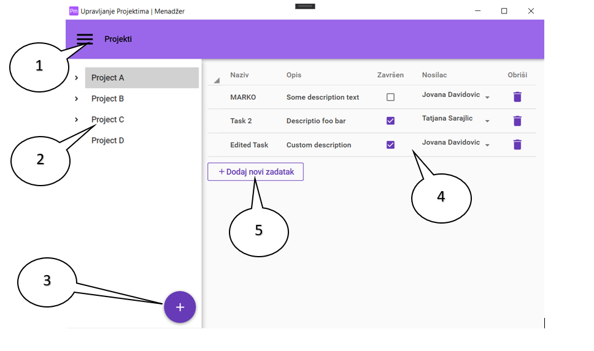
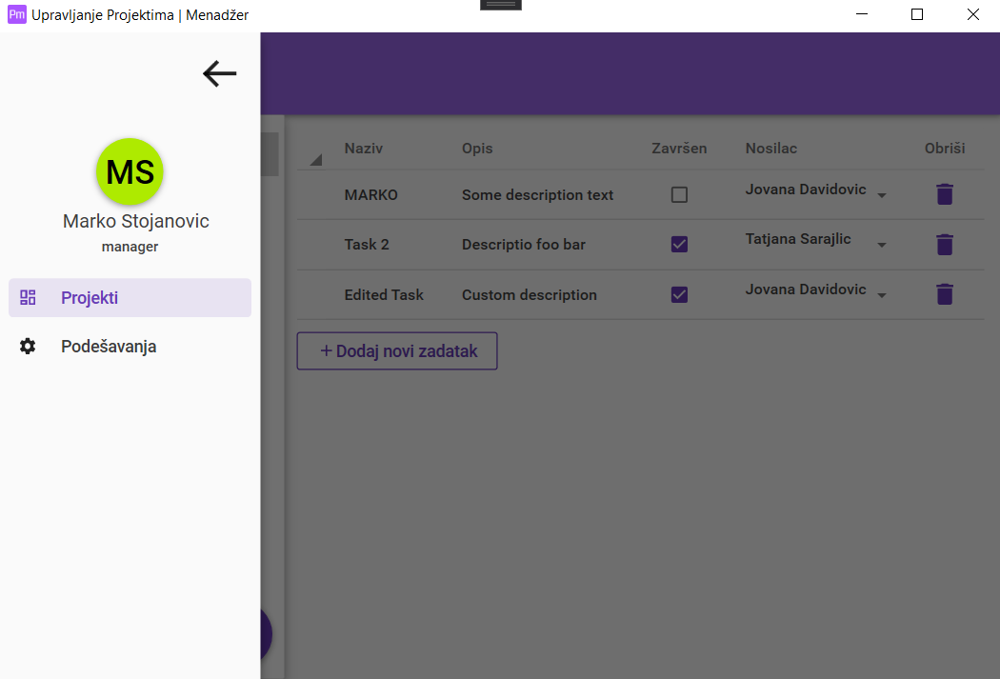
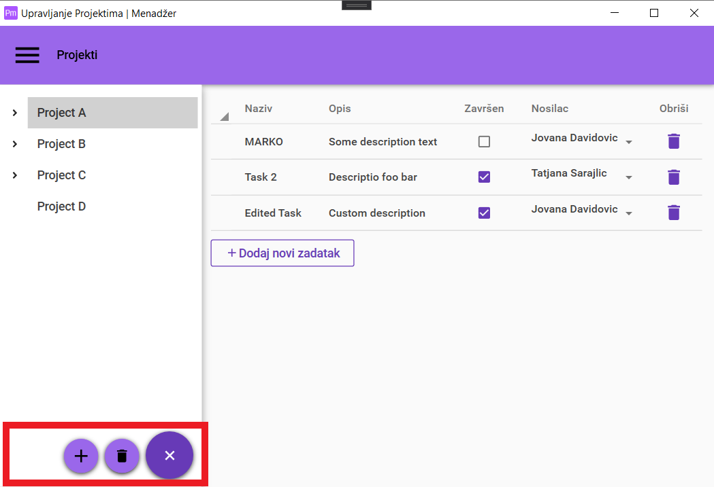
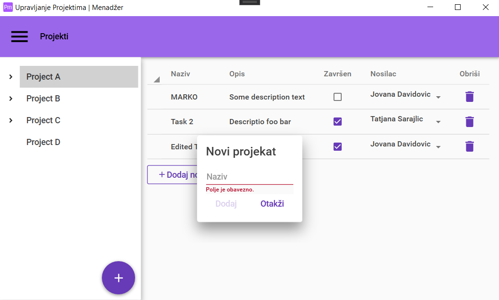
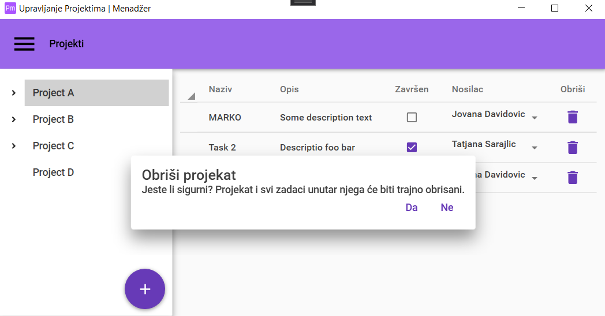
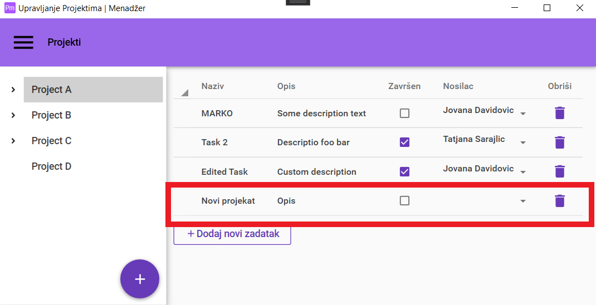
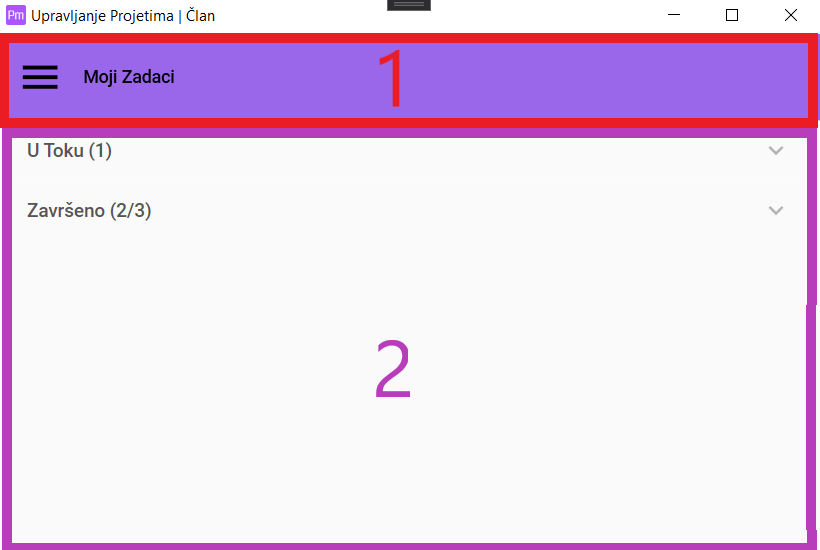
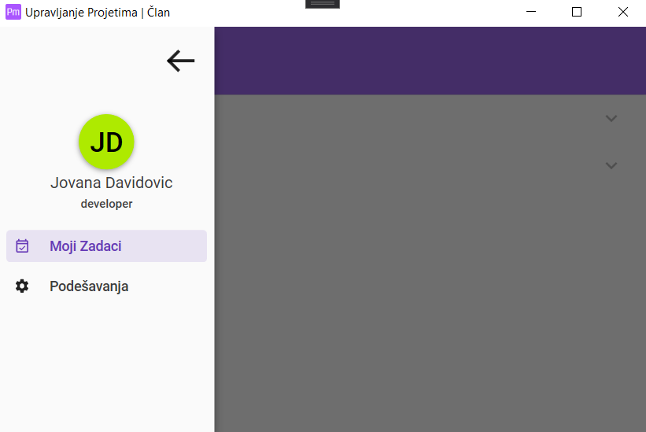
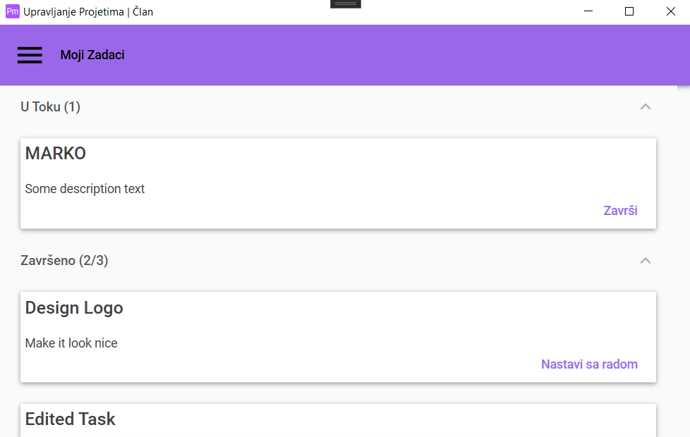
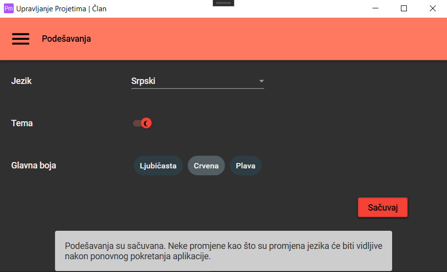

# 1. Pregled

Project Managment je Desktop aplikacija za Windows, namjenjena za upravljanje manjim projektima. Podržava dva tipa korisnika:

1. Menadžer
2. Član (Developer, Dizajner, Tester...)

Prilikom prijave korisnika, aplikacija prepoznaje tip i automatski pokreće dio sistema za rad sa određenim tipom korisnika.

## Dio za rad sa Menadžerom

Osnovna funkcija menadžera je da upravlja projektima: kreiranje, brisanje, ažuriranje te da kreira i pregleda zadatke, dodijeljuje ih članovima tima.
Upotreba ovog podsistema je detaljnije opisana u drugom poglavlju ovog dokumenta.

## Dio za rad sa Članom

Članovi mogu da pregledaju zadatke koje im je menadžer dodijelio te da ih označe kao *završene* ili *u toku*.

## Zajedničke funcionalnosti

Oba tipa korisnika mogu da mijenjaju podešavanja aplikacije, kao što su jezik i izgled aplikacije, te da ih sačuvaju.

# 2. Dio za rad sa menadžerom

Nakon prijave na sistem, korisniku će biti prikazan ekren sličan ekranu prikazanom na sledećoj slici.

- Statusna linija sa dugmetom za meni [1]
- Lista projekata [2]
- Dugme za rad sa projektima [3]
- Pregled označenog projekta [4]
- Dugme za dodavanje novog zadatka [5]

## 2.1 Statusna linija sa dugmetom za meni

Na statusnoj liniji nalazi se naziv trenutnog taba ("Projektni" na prethodnoj slici) kao i dugme za meni. Klikom na dugme za meni otvara se meni sa lijeve strane ekrana (prikazan na sl. slici).

U gornjem desnom uglu nalazi se dugme za zatvaranje menija (<-). Meni se takođe može zatvoriti i klikom bilo gdje izvan menija (potamljeni dio aplikacije na slici iznad).

Ispod se nalaze podaci o trenutno prijavljenom korisniku (slika sa inicijalima, ime i prezime te tip korisnika).

I još imamo glavne stavke menija, koje nam služe za navigaciju kroz aplikaciju. (npr. na slici iznad vidimo da je trenutno aktivna stranica  *Projekti* i klikom na *Podešavanja* otvara se stranica za podešavanja, koja će biti detaljnije opisana u nastavku dokumenta).

## 2.2 Lista projekata

Ovde je prikazana lista svih projekata na kojima je prijavljeni korisnik menadžer. Odabirom projekta u listi prikazuju se detalji o projektu (tabla sa desne strane, koja sadrzi spisak svih zadataka u odabranom projekti), a takođe ga je moguće obrisati.

## 2.3 Dugme za rad sa projektima

Klikom na ovo dugme prikazuju se opcije za rad sa projektom (slika ispod).

### 2.3.1 Dodavanje projekta

Dodavanje projekta se vrši klikom na dugme *plus* **+** (prvo dugme sa lijeve strane u označenom kvadratu na slici iznad). Nakon toga se prikazuje dialog (slika ispod).

Primjetimo da je dugme dodaj onemogućeno dok se ne popuni polje za naziv projekta, radi onemogućavanja nevalidnog unosa. Nakon popunjavanja polja za naziv i klika na dugme **Dodaj** projekat će biti kreiran i dodat u listu projekata.

### 2.3.2 Brisanje projekta

Brisanje projekta se vrši tako što u listi projekata odabaremo željeni projekat, zatim kliknemo na dugme za rad sa projektima i kliknemo na dugme za brisanje (Dugme sa ikonicom kante za smeće). Nakon toga će se prikazati dialog za potvrdu prikazan na slici ispod. Nakon potvrde unosa projekat će biti uklonjen iz liste projekata.

## 2.4 Pregled označenog projekta

Nakon što korisnik u listi projekata odabare željeni projekat, sa desne strane liste će u tabeli biti prikazani svi zadaci iz odabranog projekta. Radi lakšeg pregleda, tabela je sortabilna po svim kolonama. Pa tako korisnik lako može da vidi nedodjeljene zadatke, Zadatke koji su završeni itd. Važno je napomenuti da menadžer može da ažurira zadatke, izmjenom polja u tabeli. Dakle može da mijenja naziv, opis, status te nosioca zadatka. On takođe može da obriše zadatak klikom na dugme sa ikonicom kante za smeće koja se nalazi na kraju reda tabele.

## 2.5 Dugme za dodavanje novog zadatka

Postupak za dodavanje novog zadatka je sledeći:

1. U listi projekata odaberemo projekat u koji želimo da dodamo novi zadatak.
2. Kliknemo na dugme **Dodaj novi zadatak**, nakon čega će u tabelu biti dodan novi red, sa podrazumjevanim vrijednostima.
3. Konačno ažuriramo polja i popunjavamo ih željenim vrijednostima, koje će automatski biti sačuvane.

# 3. Dio za rad sa članovima

Nakon uspješne prijave, korisniku se prikazuje prozor kao na slici ispod.

1. Statusna linija sa dugmetom za meni [1]
2. Glavni dio [2]
   
## 3.1 Statusna linija sa dugmetom za meni

Ima iste funkcionalnosti kao i kod dijela sa rad sa menadžerom, s tim da se samo razlikuju stavke menija.

## 3.2 Rad sa zadacima

Svi zadaci koji su dodijeljeni korisniku su grupisani na zadatke koji su **U toku** i koji su **Završeni**. Klikom na njih se otvaraju liste sa željenim zadacima. Liste sadrže detalje o pojedinim zadicima kao i opcije za završavanje zadatka i nastavak rada na zadatku respektivno.

# 4. Podešavanja

Obe vrste korisnika mogu da mijenjaju podešavanja aplikacije. Postupak promjene podešavanja je sledeći:

1. Kliknuti da meni dugme na statusnoj liniji
2. Odabrati opciju "Podešavanja"
3. Zatim se otvara stranica za rad sa podešavanjima
4. Korisnik bira željena podešavanja
5. Snimanje izmjena klikom na dugme "Sačuvaj"

